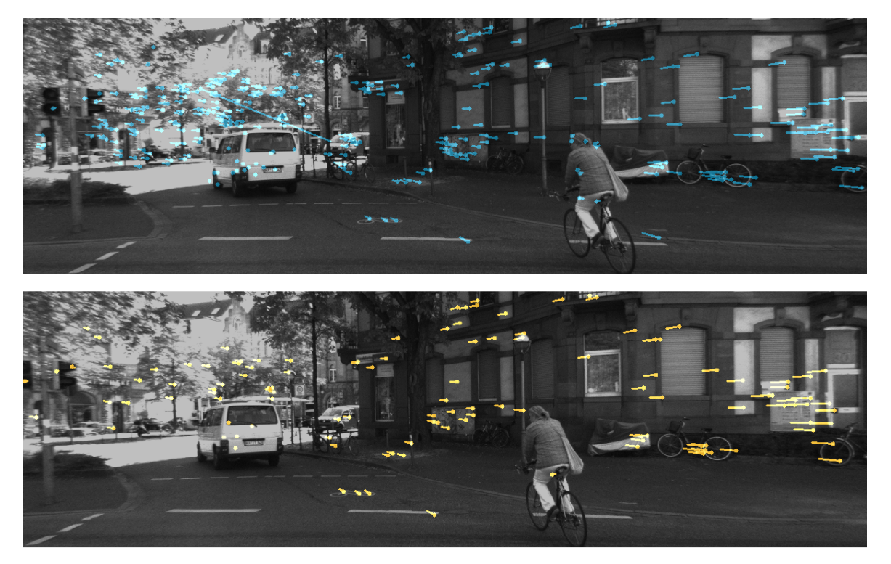
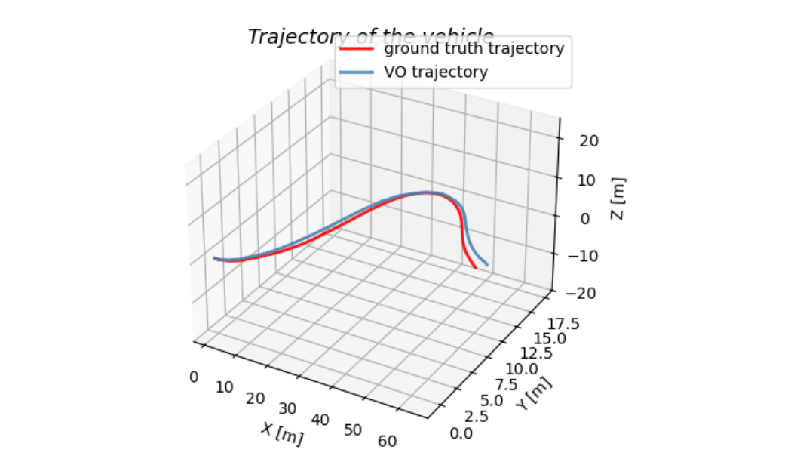

# Stereo Visual Odometry with RANSAC and Weighted Point Cloud Alignment

This repository implements a stereo-camera visual odometry (VO) pipeline for vehicle pose estimation using the KITTI dataset.

## Overview
The project estimates the pose of a vehicle with respect to the first frame using stereo image measurements. The main focus is on:
- RANSAC-based outlier rejection
- scalar-weighted 3D point cloud alignment
- trajectory comparison against ground truth
- inlier feature visualization on the right image plane

This project was developed for a university UAV/autonomous systems lab on stereo visual odometry.

## Method
The pipeline follows these main steps:
1. Detect and describe image features using SIFT
2. Match feature correspondences across stereo pairs and consecutive frames
3. Filter correspondences with stereo geometry constraints
4. Reconstruct 3D points from stereo disparity
5. Use RANSAC to reject outliers
6. Estimate relative motion with weighted rigid 3D alignment
7. Accumulate frame-to-frame motion into a full vehicle trajectory
8. Compare the estimated trajectory against ground truth

## Files
- `run_vo.py` — main script for running visual odometry, saving video, and evaluating trajectory error
- `stereo_vo_base.py` — stereo camera model and VO pipeline implementation
- `requirements.txt` — Python dependencies
- `.gitignore` — excludes generated files and local data products
- `Figures/` — result images for README visualization

## Features
- Stereo feature matching with SIFT
- Epipolar and disparity-based correspondence filtering
- RANSAC outlier rejection
- Scalar-weighted point cloud alignment using SVD
- Inlier visualization on the right image plane
- Video export of tracked features
- RMSE-based trajectory evaluation against ground truth

## Data
This repository does **not** include the KITTI dataset or the ground-truth `.mat` file.

To run the code, you need to prepare:
- KITTI stereo image data
- `ground_truth_pose.mat`

You may also need to update the image paths inside `run_vo.py` to match your local directory structure.

## How to Run
Install dependencies:

```bash
pip install -r requirements.txt
```

Then run:

```bash
python run_vo.py
```

The script will:
- load the stereo image sequence,
- run the VO pipeline frame by frame,
- visualize matched and inlier features,
- save a video file,
- compute trajectory RMSE,
- plot the estimated and ground-truth trajectories.

## Figures

### Inlier Feature Visualization


### Estimated Trajectory vs Ground Truth


## Example Outputs
Typical outputs include:
- inlier feature tracking visualization
- saved video of the VO process
- estimated trajectory vs. ground truth
- RMSE values in x, y, z, and 3D position

## Notes
- The KITTI dataset is not redistributed in this repository.
- The ground truth file is also not included.
- You may need to adjust dataset paths before running the script.
- This repository focuses on the project-specific VO implementation rather than the full dataset setup.

## Repository Structure
```text
stereo-visual-odometry-ransac/
├─ Figures/
│  ├─ inliers_example.png
│  └─ trajectory.png
├─ .gitignore
├─ README.md
├─ requirements.txt
├─ run_vo.py
└─ stereo_vo_base.py
```

## Future Improvements
Possible next steps include:
- replacing brute-force matching with more robust correspondence strategies
- improving motion estimation under large viewpoint changes
- adding bundle adjustment or sliding-window refinement
- integrating IMU information for visual-inertial odometry
- improving robustness in low-texture or dynamic scenes
